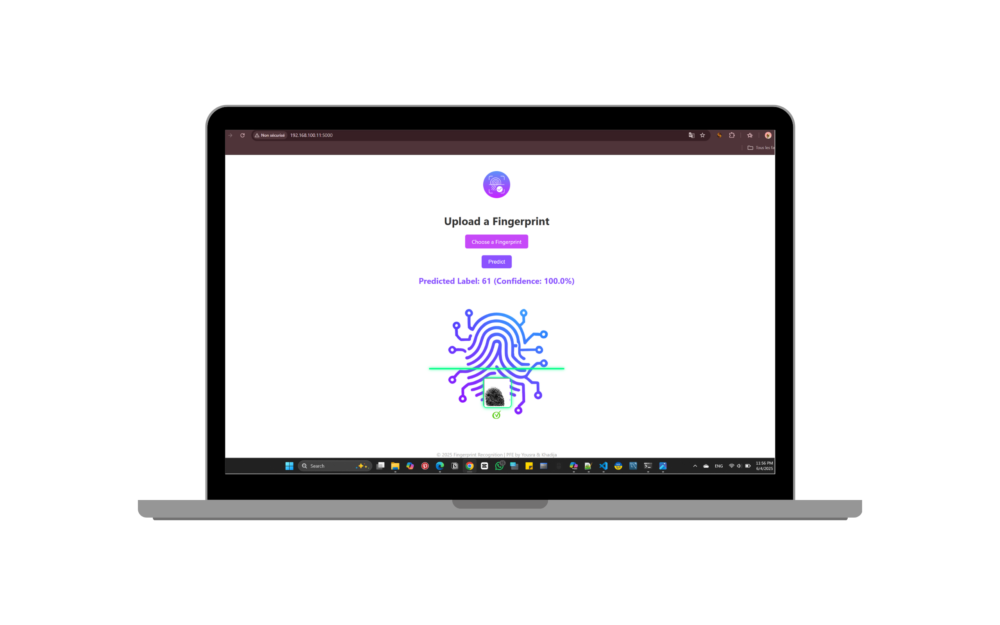

# 🧠 Fingerprint Recognition using Deep Learning and Flask

This is my final year project for fingerprint recognition using Convolutional Neural Networks (CNN). The app is built using Python and deployed with Flask.

## 📁 Project Structure

fingerprint_model/
├── app/
│ ├── app.py
│ ├── utils.py
│ ├── static/ (icons, CSS, uploads...)
│ ├── templates/ (HTML frontend)
│ └── model/ (trained model and encoder)
├── training/
│ └── notebook.ipynb (model training notebook)
├── requirements.txt
├── README.md


## 🔧 Features

- CNN model trained on SOCOFing dataset
- Flask web interface to upload fingerprint images
- Prediction of user ID from fingerprint
- Custom UI with sounds and feedback icons

## 🚀 Installation

```bash
pip install -r requirements.txt
cd app
python app.py
```
## 📸 Preview

### Homepage


### Prediction Result


🧠 Tech Stack

Python

TensorFlow / Keras

Flask

OpenCV

HTML/CSS

## 👩‍💻 Author

**Bachri Yousra**  
[GitHub](https://github.com/youcy03) – [Email](mailto:yousra.bachri03@gmail.com)
